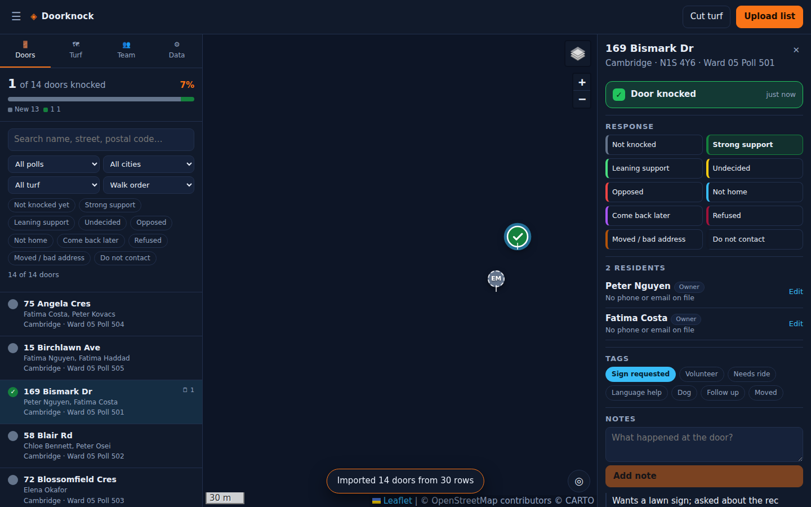

# Doorknock

A canvassing map for people knocking doors. Load a spreadsheet of voters, get a pin for every
door, colour the map by community, and record what happened at each door — on a phone, while
walking, with your own position moving on the map.

Runs as a website or as an Android app. No server, no account, no database: the data lives in
the browser (or the app) on your device.



_Basemap tiles are blank in these captures — the machine that took them had no route to the tile
servers. They load normally on a real network._

## What it does

**Load your list**
- `.xlsx`, `.xls` or `.csv`, read in the browser — the file is never uploaded anywhere.
- Guesses which column is the name, address, city, postal code, poll, community, and so on, and
  lets you fix any of them before importing.
- Handles a split address — `Street #` + `Street # Suffix` + `Street Name` + `Unit #` — as well as a
  single address column, and asks for a city when the sheet has no city column.
- People at the same address become one door with several residents.
- Understands `LASTNAME, FIRSTNAME`, strips `UNIT 27` off an address, and re-spaces Canadian
  postal codes (`N1S4C2` → `N1S 4C2`).
- Columns you don't map are kept and come back in the export.

**Communities on the map**
- Every door belongs to a group: **Muslim**, **Punjabi / Sikh**, **Hindu**, **Other minority**,
  **Everyone else**, or **Not classified**.
- The group comes from a column in your list (called Community, Group, Religion, Ethnicity…), from
  **tagging a whole file** as one group while importing it, or from one tap on the door sheet.
- That tagging is how single-community lists work: load the full ward list first, then load a
  Muslim list and a Punjabi list on top with **"Everyone in this file is"** set. Matching doors are
  tagged in place rather than duplicated, and any address the ward list missed is added.
- Only groups that actually have doors appear in the layer panel.
- Pins are coloured by group, and the ◍ **Layers** panel switches any group on or off, so you can
  walk one community's doors and hide the rest.
- Switch pin colour to **Response** when you'd rather see support and opposition.
- The app does **not** guess a person's community from their name. Name matching is wrong often
  enough to send a canvasser into the wrong conversation — put the classification in your
  spreadsheet, where you control it, or set it at the door.

**You, on the map**
- A blue dot with an accuracy halo follows your GPS while you walk, so you can see which house is
  next.
- The map follows you until you drag it; the ◎ button starts following again.
- On Android this uses the phone's real GPS through a native permission prompt.

**Knock doors**
- Tap a pin: residents, occupancy, phone, email, poll, and every original column from your sheet.
- One tap marks the door knocked — the pin gets a tick.
- Four responses cover almost every door (support, not home, undecided, opposed); the rest —
  strong support, come back later, refused, moved, do not contact — are behind "More options".
- Timestamped notes, quick tags (sign requested, volunteer, needs ride, dog…), and inline fixes to
  phone and email when the list is out of date.

**Organise the walk**
- **Turf**: draw a shape on the map and every door inside becomes a turf with its own progress.
- **Team**: add canvassers, assign turf, pick who is knocking — their name is stamped on knocks and
  notes.
- Search and filter by response, poll, city, turf or canvasser; sort in walk order (street, then
  house number) or by what is closest to you.

**Get the data out**
- An `.xlsx` that keeps every original column and adds status, knocked-at, visits, notes, tags,
  community, turf, canvasser and coordinates.
- A project `.json` that carries the whole workspace to another device.

## Run it on the web

```bash
npm install
npm run dev            # http://localhost:5173
npm run dev -- --host  # also reachable from your phone on the same wifi
```

`sample-data/placeholder-list.csv` is a placeholder list (no real people) with coordinates already
in it, so you can try everything without waiting for geocoding.

To publish it: `npm run build` produces a `dist/` folder of static files. Pushing to `main` deploys
it to GitHub Pages automatically once Pages is switched on (Settings → Pages → Source: GitHub
Actions).

## Build the Android app

```bash
npm run build
npx cap sync android
cd android && ./gradlew assembleDebug
# android/app/build/outputs/apk/debug/app-debug.apk
```

Requires JDK 21 and the Android SDK (platform 34+, build-tools 35). Pushing to `main` also builds
the APK in GitHub Actions — download it from the run's artifacts.

**Installing it on a phone**

1. Copy the `.apk` to the phone (email, Google Drive, or USB into Downloads).
2. Open **Files → Downloads** and tap it.
3. When Android says the source isn't allowed, tap **Settings → Allow from this source**, then Back.
4. Tap **Install**. If Play Protect warns about an unknown app, choose **Install anyway** — that
   warning is about sideloading, not about this app.
5. Open Doorknock and choose **While using the app** when it asks for location. Leave "Precise" on.

**Signing, and why it matters.** `assembleDebug` signs with a throwaway key, so a later build will
refuse to install over an earlier one — and uninstalling wipes every knock stored on that phone.
For anything beyond a first try, build a release with one stable key:

```bash
keytool -genkey -v -keystore doorknock.keystore -alias doorknock \
  -keyalg RSA -keysize 2048 -validity 10000
DOORKNOCK_KEYSTORE=/path/to/doorknock.keystore \
DOORKNOCK_KEYSTORE_PASSWORD=… DOORKNOCK_KEY_PASSWORD=… \
  ./gradlew assembleRelease
```

Keep that keystore safe — it is the only thing that lets you ship updates. Export your data before
uninstalling anything.

## Putting addresses on the map

Addresses become pins through a geocoder:

- **OpenStreetMap Nominatim** (default, free). Their policy allows about one address per second, so
  1,000 doors take roughly 20 minutes. Results are cached, so you pay that once. Put an email
  address in **List → settings** so OSM can contact you instead of blocking you.
- **Mapbox** with a token — same flow, roughly ten times faster.
- If your sheet already has latitude/longitude columns, nothing is geocoded at all.

Addresses that can't be found are listed for you; open one and place its pin by hand.

**This is the one time your data leaves the device**: the address is sent to whichever geocoder you
pick. Names, notes, phone numbers, responses and community labels never are.

## Where the data lives

IndexedDB, in the browser or app on that device. Nothing syncs.

- Closing the app is safe — everything is saved as you go and restored when you come back.
- Clearing site data (or uninstalling the app) deletes it. Export a project file first.
- Two canvassers on two phones have two separate workspaces. Give each their own turf and merge by
  exporting each phone's `.xlsx` at the end of the shift.

Live multi-device sync needs a backend, which this deliberately doesn't have.

## Stack

React + TypeScript + Vite, Leaflet with marker clustering, Capacitor for the Android wrapper,
SheetJS for spreadsheets (loaded on demand), Zustand for state, idb-keyval for storage. Map tiles
from OpenStreetMap and Esri. No API keys needed except the optional Mapbox geocoder.

```
src/
  components/  MapView, ImportWizard, DoorList, HouseholdPanel, LayersPanel, MenuPanel, TurfTab, TeamTab, DataTab
  lib/         parse, normalize, communities, geocode, geolocation, geo, storage, export
  state/       store (zustand), useGeocoder
android/       Capacitor Android project
scripts/       build-demo.mjs — one self-contained HTML file, tiles and all
```

## Known limits

- No sync between devices.
- Geocoding needs a connection; the map needs a connection for tiles unless you build the offline
  demo page.
- The Android build is a debug APK meant for sideloading to your own team.
